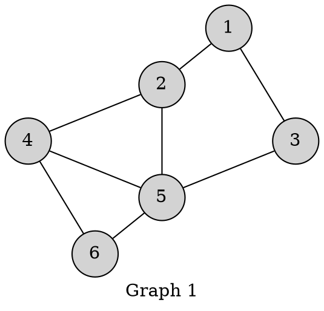
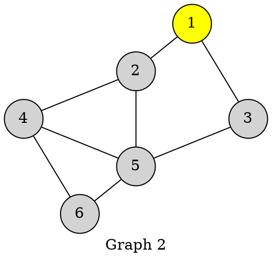
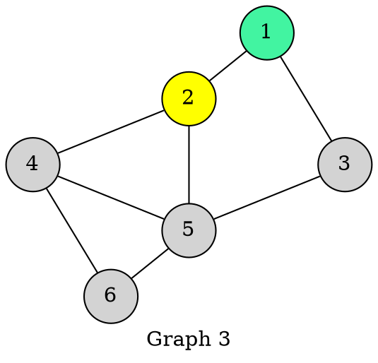
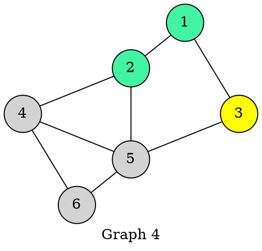
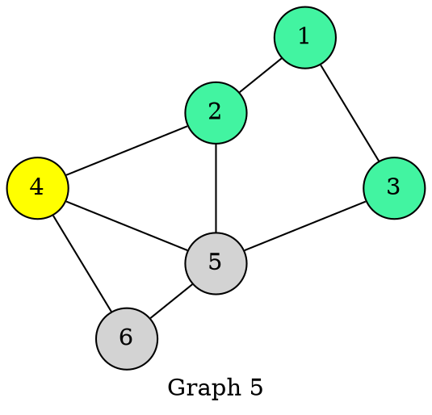
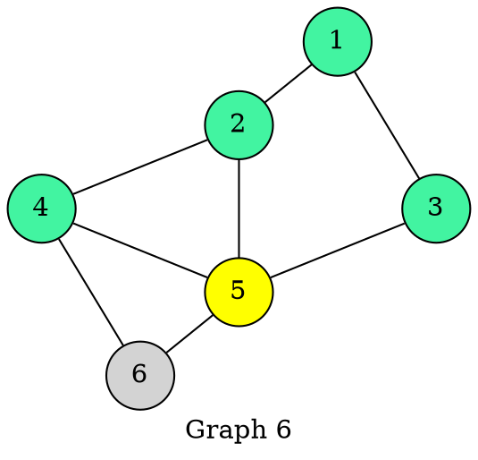
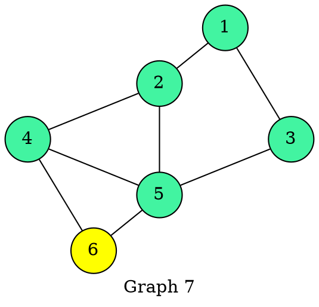
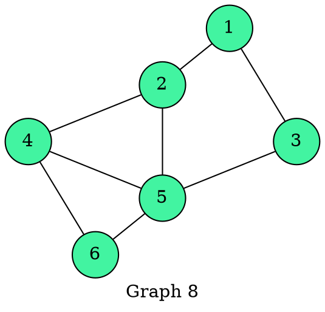

**Think of this**: You are in a node 1 of tree below. You need to find a way out traversing all nodes.

Intuitively you could think of two ways. 
1. You could choose a node adjacent to you, hop in to that, choose node adjacent to that node, hop in to that, and so on. This would be **depth** first. 
2. You could choose all nodes adjacent to you one step away, note them as visited and do the same again in those neighbour nodes and so on. This is **breadth** first which we will understand here. 

Here is a gif I found online that could give a BFS visual feel:  

**Note**: I have intentionally written down each step explicitly to show how we end up in loop instead of showing looping upfront. This helps reader to first grasp what is going on, and then look  back at the steps, note repetitive nature and optimize it as a loop. Intuitively, we repeat similar steps in every node and that is reflected as loop eventually in our algo. Also just stick with each step instead of reasoning upfront, as as we move down, the logic would become clearer.

Coming to our graph, we will have below structures to note down our progress and to refer back as we traverse. 

**Initialization**:
| Node    | 1 | 2 | 3 | 4 | 5 | 6 |
|---------|---|---|---|---|---|---|
| Visited | 0 | 0 | 0 | 0 | 0 | 0 |
| Queue   |   |   |   |   |   |   | 
| Print   |   |   |   |   |   |   |   

We have not traversed yet, so all elements of visisted list/array are 0. 

**Step 1**: We start with node 1.

1. We mark **1** as visited as we are already there.  
2. We enter **1** in Queue.

| Node    | 1 | 2 | 3 | 4 | 5 | 6 |
|---------|---|---|---|---|---|---|
| Visited |<mark>1</mark>| 0 | 0 | 0 | 0 | 0 |
| Queue   |<mark>1</mark>|   |   |   |   |   |
| Print   |   |   |   |   |   |   | 

3. Is Queue empty? No, isn't it?
4. So we take/pop it out, that is take 1st element **1** (*Queue is first in first out*) and print it.

| Node    | 1 | 2 | 3 | 4 | 5 | 6 |
|---------|---|---|---|---|---|---|
| Visited | 1 | 0 | 0 | 0 | 0 | 0 |
| Queue   |   |   |   |   |   |   | 
| Print   |<mark>1</mark>|   |   |   |   |   |

5. The adjacent vertices of 1 are (2 , 3)
6. Visit the unvisited (*Its not we actually visit 2 and 3 per se. We just evaluate*). Update in visited list and push it in Queue from back (*FIFO*).

| Node    | 1 | 2 | 3 | 4 | 5 | 6 |
|---------|---|---|---|---|---|---|
| Visited | 1 |<mark>1</mark>|<mark>1</mark>| 0 | 0 | 0 |
| Queue   |<mark>2</mark>|<mark>3</mark>|   |   |   |   |
| Print   | 1 |   |   |   |   |   |

7. Is Queue empty? No, isn't it? (*Smell Step 3*)
8. So we take/pop it out, that is take 1st element **2** and print it. Note due to pop, next element in Queue, that is **3** moves one step front.

| Node    | 1 | 2 | 3 | 4 | 5 | 6 |
|---------|---|---|---|---|---|---|
| Visited | 1 | 1 | 1 | 0 | 0 | 0 |
| Queue   |<mark>3</mark>|   |   |   |   |   |
| Print   | 1 |<mark>2</mark>|   |   |   |   |

9. The adjacent vertices of 2 are (1, 4, 5)
10. Visit the unvisited (*1 is already visited, only 4 and 5 to be visited*. ). Update in visited list and push it in Queue from back.

| Node    | 1 | 2 | 3 | 4 | 5 | 6 |
|---------|---|---|---|---|---|---|
| Visited | 1 | 1 | 1 |<mark>1</mark>|<mark>1</mark>| 0 |
| Queue   | 3 |<mark>4</mark>|<mark>5</mark>|   |   |   |
| Print   | 1 | 2 |   |   |   |   |

11. Is Queue empty? No, isn't it? 
12. So we take/pop it out, that is take 1st element **3** and print it.

| Node    | 1 | 2 | 3 | 4 | 5 | 6 |
|---------|---|---|---|---|---|---|
| Visited | 1 | 1 | 1 | 1 | 1 | 0 |
| Queue   |<mark>4</mark>|<mark>5</mark>|   |   |   |   |
| Print   | 1 | 2 |<mark>3</mark>|   |   |   |

13. The adjacent vertices of 3 are (1, 5)
14. Visit the unvisited (*Both 1 and 5 are visited*. ). So nothing to update in visited list and to push in queue at this step.

| Node    | 1 | 2 | 3 | 4 | 5 | 6 |
|---------|---|---|---|---|---|---|
| Visited | 1 | 1 | 1 | 1 | 1 | 0 |
| Queue   | 4 | 5 |   |   |   |   |
| Print   | 1 | 2 | 3 |   |   |   |

15. Is Queue empty? No, isn't it? 
16. So we take/pop it out, that is take 1st element and print it.

| Node    | 1 | 2 | 3 | 4 | 5 | 6 |
|---------|---|---|---|---|---|---|
| Visited | 1 | 1 | 1 | 1 | 1 | 0 |
| Queue   |<mark>5</mark>|   |   |   |   |   |
| Print   | 1 | 2 | 3 |<mark>4</mark>|   |   |

17. The adjacent vertices of 4 are (2, 5 and 6)
18. Visit the unvisited (*2 and 5 already visited, only 6 to be visited*. ). Update **6** in visited list and push it in Queue from back.

| Node    | 1 | 2 | 3 | 4 | 5 | 6 |
|---------|---|---|---|---|---|---|
| Visited | 1 | 1 | 1 | 1 | 1 |<mark>1</mark>|
| Queue   | 5 |<mark>6</mark>|   |   |   |   |
| Print   | 1 | 2 | 3 | 4 |   |   |

19. Is Queue empty? No, isn't it? 
20. So we take/pop it out, that is take 1st element and print it.

| Node    | 1 | 2 | 3 | 4 | 5 | 6 |
|---------|---|---|---|---|---|---|
| Visited | 1 | 1 | 1 | 1 | 1 | 1 |
| Queue   |<mark>6</mark>|   |   |   |   |   |
| Print   | 1 | 2 | 3 | 4 |<mark>5</mark>|   |

21. The adjacent vertices of 5 are (2, 3, 4 and 6)
22. Visit the unvisited (*all are visited*). So nothing to update in visited list and to push in queue at this step.

| Node    | 1 | 2 | 3 | 4 | 5 | 6 |
|---------|---|---|---|---|---|---|
| Visited | 1 | 1 | 1 | 1 | 1 | 1 |
| Queue   | 6 |   |   |   |   |   |
| Print   | 1 | 2 | 3 | 4 | 5 |   |

23. Is Queue empty? No, isn't it? 
24. So we take/pop it out, that is take 1st element and print it.

| Node    | 1 | 2 | 3 | 4 | 5 | 6 |
|---------|---|---|---|---|---|---|
| Visited | 1 | 1 | 1 | 1 | 1 | 1 |
| Queue   |   |   |   |   |   |   |
| Print   | 1 | 2 | 3 | 4 | 5 |<mark>6</mark>|

25. The adjacent vertices of 6 are (4 and 5)
26. Visit the unvisited (*all are visited*). So nothing to update in visited list and to push in queue at this step.

| Node    | 1 | 2 | 3 | 4 | 5 | 6 |
|---------|---|---|---|---|---|---|
| Visited | 1 | 1 | 1 | 1 | 1 | 1 |
| Queue   |   |   |   |   |   |   |
| Print   | 1 | 2 | 3 | 4 | 5 | 6 |

27. Is Queue empty? **Yes**

No more nodes in Queue to be processed, but hey, by this time, we also
have finished traversing all nodes! Its time to end the program. 

