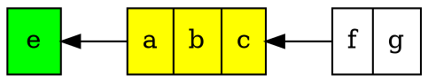
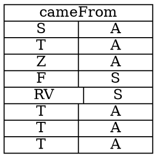

Ref: http://soc.if.usp.br/manual/graphviz/html/info/shapes.html

```dot
digraph structs {
    
    node [shape=record width=0.4];
    rankdir=RL;

    queue1 [label="{ <f0> a |<f1> b |<f2> c }" style=filled fillcolor=yellow];
    current [label="e" style=filled fillcolor=green];
    queue2 [label="{ <f0> f |<f1> g }"];
    
    queue1:f0 -> current;
    queue2:f0 -> queue1:f2;

}
```

```dot
digraph g {
     node [shape = record width=2 height=2 fixedsize=true];
     node1[label = "{cameFrom|{ S |A } | {T |A} | {Z|A} | {F|S} | {RV|S} | {T|A} | {T|A} | {T|A} }"];
   }
```