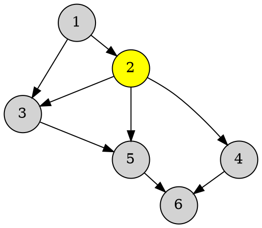

**This is a sample markdown page**  

This is just a text  

This is a formula  
$\displaystyle p(X_{i}^{t})=\sum\limits_{{k=1}}^{n}{{p(X_{k}^{{t-1}})p(X_{i}^{t}|X_{k}^{{t-1}})}}$

**A table**
|Visited|0|
|:---------------------------------------------:|----|
|              Queue                 |0