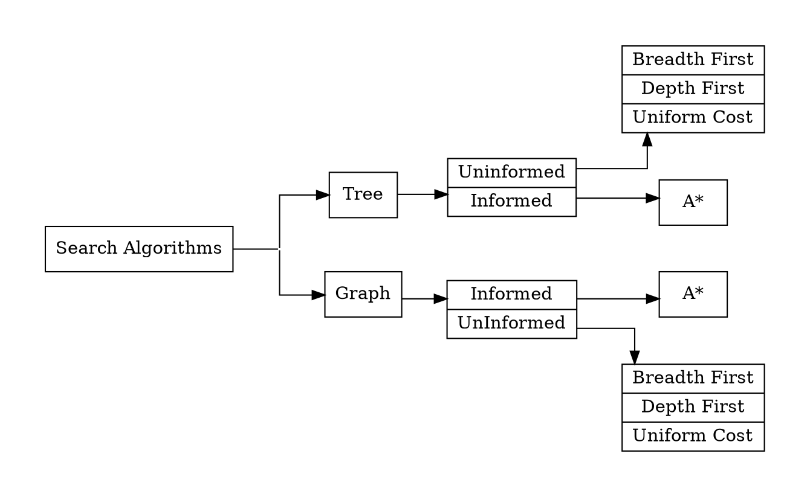

**Below is the draft plan**

```dot {engine="dot"}
digraph G {

    node [shape=record];
    graph[rankdir="LR" splines=ortho pad="0.5", nodesep="0.5", ranksep="0.5"];

    SA [label="Search Algorithms"];  

    TA [label="Tree"];
    GA [label="Graph"];

    TA_types [label="<f0>Uninformed | <f1>Informed"];
    GA_types [label="<f1>Informed | <f0>UnInformed"];

    TA_UI_types [label="Breadth First | Depth First | Uniform Cost "];
    GA_UI_types [label="Breadth First | Depth First | Uniform Cost "];

    TA_I_types [label="A* "];
    GA_I_types [label="A*  "];

    joint1 [shape="none", label="", width=0, height=0]

    SA -> joint1 [arrowhead="none"]
    joint1 -> TA -> TA_types;
    joint1 -> GA -> GA_types;

    TA_types:f0 -> TA_UI_types;
    TA_types:f1 -> TA_I_types;

    GA_types:f1 -> GA_I_types;
    GA_types:f0 -> GA_UI_types;

    
}
```