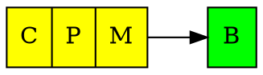
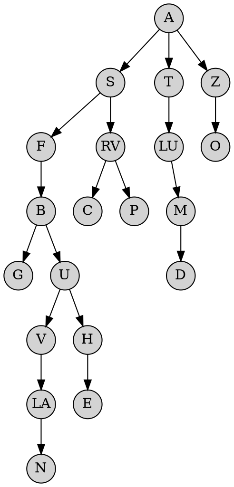
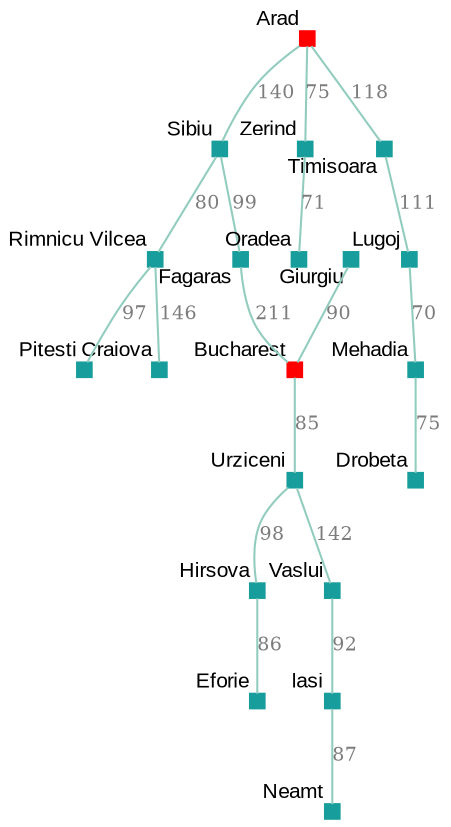
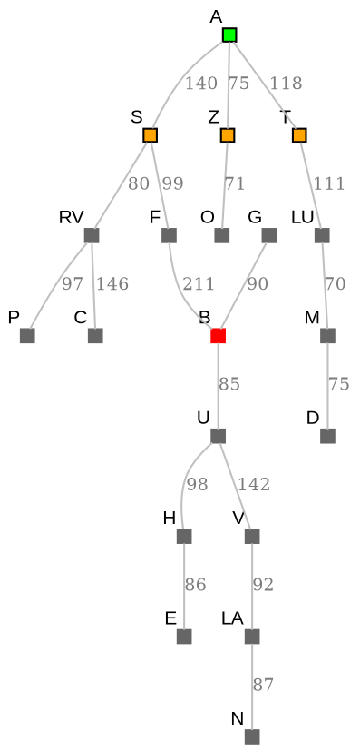
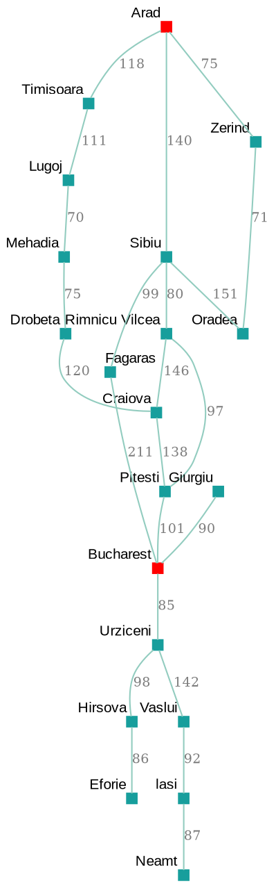
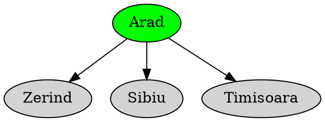

## STACK/QUEUE: Navigation example without closed loops

## TREE: Navigation example without closed loops...

## MAP: Navigation example without closed loops

**Simpler Smaller View**

## MAP: Navigation example with closed loops

